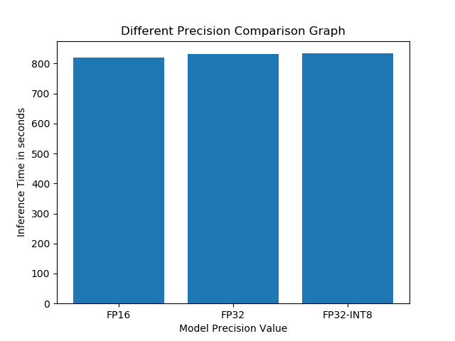

# Computer Pointer Controller
In this project we aim to control our mouse pointer using the movement of our eye. We have used four models i.e facial recognition model, landmarks detection model,
head pose detection model and finally gaze detection model. We use the facial recognition model to identify a face and then using the face captured we determine the
head pose angles and the left and right eye. Then finally, we feed the left eye, right eye, and head pose angles to the gaze estimation model which outputs the respctive
mouse pointer coordinates. Now using pyautogui we control the mouse pointer location and move it according to our gaze.

To better understand the structure of this project here is the architecture diagram of this project:

## Project Set Up and Installation

Follow the steps below:

Step 1: Install openvino 2020.1

Step 2: Create a vitual environment and activate it

Step 3: Install the dependencies by running the command 'pip install -r requirements.txt'

Step 4: Download the models from openvino using the model downloader. Eg: './downloader.py --name face-detection-retail-0004 --precisions FP16,INT8'. Refer: https://docs.openvinotoolkit.org/latest/_tools_downloader_README.html

Step 5: Now source your openvino environment using this command 'source /opt/intel/openvino/bin/setupvars.sh'

Steo 5: Run the main.py file with the arguments

Step 6: Observe the output in the project directory

## Demo
Example: Run this code using this command
    python starter/src/main.py --model starter/intel/face-detection-adas-binary-0001/FP32-INT1/face-detection-adas-binary-0001 --input cam --headpose starter/intel/head-pose-estimation-adas-0001/FP32-INT8/head-pose-estimation-adas-0001 --facialLandmark starter/intel/landmarks-regression-retail-0009/FP32-INT8/landmarks-regression-retail-0009 --gazeEstimation starter/intel/gaze-estimation-adas-0002/FP32-INT8/gaze-estimation-adas-0002

## Documentation
The python script accepts following arguments:
1. --faceModel - Path where the facial detection model has been downloaded
2. --headpose - Path where the Head Pose detection model has been downloaded
3. --facialLandmark -  Path where the Facial Landmark detection model has been downloaded
4. --gazeEstimation - Path where the Gaze Estimation model has been downloaded
5. --input accepts two argument either 'cam' for webcam or 'video file' path
6. --threshold threshold value for the models, default is 0.75

## Benchmarks
I have tried to draw a comparison between various different proecisons of the downloaded model. Please refer the images below.

1. Model Loading Time:

2. Model Inference Time:

3. Frames per second:

## Results
From the graphs we can observe that with the Precision FP16 our overall system performs slightly better than other precisons available. Another things to observe here is that the model loading time is significantly higher for FP32-INT8 as compared to FP16 or FP32.
When we look at the inference time we can observe that is well above 800 seconds which is a lot higher, it is mainly because of weak system infrastructure. A more powerful/computationly rich system will perform much better.

### Edge Cases

1. This system does not account for multiple people in a frame, if multiple people are in the same frame then it can consider any one face found and use that face to calculate other parameters like the gaze estimate.
2. Initially, the code takes a lot of time to run the whole inference, so as an optimsation step I have added a line of code that skips 10 frames and perform faster inference. This will although comprise a little bit on the accuracy front but it will perform a lot better (efficiency wise)
3. There can be a point when the mouse reaches at the corner of the screen and a fail-safe exception causes the code to stop intermittently, so to avoid this exception the fail-safe check is set to False in pyautogui which prevents the code to stop.
